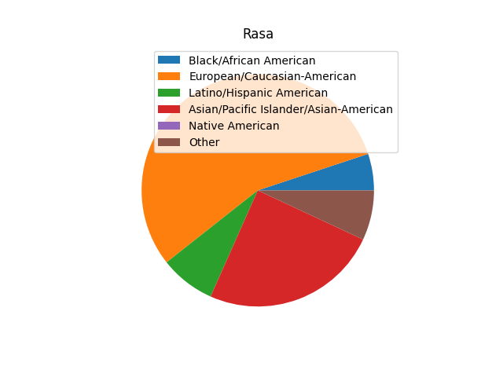
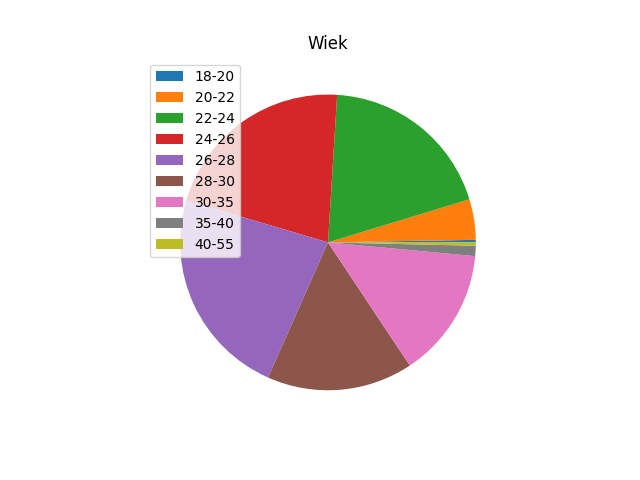

# Predykcja dopasowania w Speed Dating

Ninejszy projekt porównuje kilka sposobów na przewidywaniem dopasowań podczas tzw. szybkich randek. Wykorzystana została baza [Speed Dating Experiment](https://www.kaggle.com/annavictoria/speed-dating-experiment).

## Opis bazy

Baza składa się z opisów przeprowadzonych szybkich randek podczas eksperymentu. Opisy są bardzo bogate, jednak na potrzeby tego projektu skupiłem się na kilka, moim zdaniem, istotnych aspektach.

Algorytmy, które porównałem dokonują klasyfikacji rekordów na dwie grupy: **dopasowanie** oraz **brak dopasowania**. Informacja ta znajduje się w kolumnie **match** (wartości **0** lub **1**).

Spośród obecnych w bazie kolumn jako kolumny wejściowe wybrałem następujące:

* wiek osób randkujących (*age* oraz *age_o*),
* rasa osób randkujących (*race* oraz *race_o*),
* częstość randkowania (*date*),
* częstość wychodzenia w ogóle (*go_out*),
* ogólny poziom szczęścia (*exhappy*)

oraz poniższe cechy w 4 wersjach (własne preferencje, opinia osoby na temat partnera, preferencje partnera, opinia partnera o osobie):

* atrakcyjny (*attr1_1*, *attr*, *pf_o_att*, *attr_o*),
* szczery (*sinc1_1*, *sinc*, *pf_o_sin*, *sinc_o*).
* inteligentny (*intel1_1*, *intel*, *pf_o_int*, *intel_o*),
* zabawny (*fun1_1*, *fun*, *pf_o_fun*, *fun_o*),
* ambitny (*amb1_1*, *amb*, *pf_o_amb*, *amb_o*),
* wspólne zainteresowania (*shar1_1*, *shar*, *pf_o_shar*, *shar_o*).

Poniżej przedstawiam, jak prezentowały się dane w bazie dla wyżej wymienionych kolumn.

| Kolumna | Min | Max | Średnia |Procent brakujących danych |
| ---- | --- | --- | ---- | ----- |
|age|18.0|55.0|26.358927924664975|0.0113392217713058|
|age_o|18.0|55.0|26.36499879139473|0.012413463833850561|
|race|1.0|6.0|2.7571858087793144|0.007519694437813321|
|race_o|1.0|6.0|2.7566526189042744|0.00871329672952972|
|date|1.0|7.0|5.00676246830093|0.011577942229649082|
|go_out|1.0|7.0|2.158091336305579|0.00942945810455956|
|exphappy|1.0|10.0|5.534130723692159|0.012055383146335641|
|attr1_1|0.0|100.0|22.514631883359332|0.00942945810455956|
|attr|0.0|10.0|6.189995107632094|0.024110766292671282|
|pf_o_att|0.0|100.0|22.49534684521648|0.01062306039627596|
|attr_o|0.0|10.5|6.190411462160177|0.02530436858438768|
|sinc1_1|0.0|60.0|17.39638872153271|0.00942945810455956|
|sinc|0.0|10.0|7.175163560054314|0.03306278348054428|
|pf_o_sin|0.0|60.0|17.396866932078645|0.01062306039627596|
|sinc_o|0.0|10.0|7.175256457792609|0.03425638577226068|
|intel1_1|0.0|50.0|20.26561272442462|0.00942945810455956|
|intel|0.0|10.0|7.368596881959911|0.03533062783480544|
|pf_o_int|0.0|50.0|20.270758837012853|0.01062306039627596|
|intel_o|0.0|10.0|7.369301288404361|0.036524230126521846|
|fun1_1|0.0|50.0|17.4570430691278|0.01062306039627596|
|fun|0.0|10.0|6.400597907324364|0.041776080210074|
|pf_o_fun|0.0|50.0|17.45971376811598|0.01169730245882072|
|fun_o|0.0|11.0|6.400598653030681|0.0429696825017904|
|amb1_1|0.0|53.0|10.682538953979968|0.011816662687992361|
|amb|0.0|10.0|6.777524132533264|0.08498448317020768|
|pf_o_amb|0.0|53.0|10.685375408052264|0.012771544521365481|
|amb_o|0.0|10.0|6.778409090909091|0.08617808546192408|
|shar1_1|0.0|30.0|11.845110815065958|0.014442587729768442|
|shar|0.0|10.0|5.474558883873615|0.12735736452613988|
|pf_o_sha|0.0|30.0|11.845930415807954|0.015397469563141562|
|shar_o|0.0|10.0|5.474869898657902|0.12843160658868466|

Poniżej prezentuję wykresy kołowe opisujące wartości w poszczególnych kolumnach (ignorując brakujące dane).

.png)

## Przygotowanie bazy

Przed rozpoczęciem działania na wybranych kolumnach usunąłem wiersze, w których brakowało danych. Następnie podzieliłem wiersze na zbiory treningowy i testowy w stosunku 7 : 3.

## Porównywane algorytmy

Do porównania użyłem następujące algorytmy:

* drzewo decyzyjne,
* Naive Bayes
* *k* najbliższych sąsiadów (dla k = 3, 5, 7)
* sieć neuronowa

### Budowa sieci neuronowej

Sieć neuronową zbudowałem z następujących 3 warstw

1. warstwa gęsta składające się z 31 neuronów (tyle, ile kolumn na wejściu) z funkcją aktywacji `relu`,
2. warstwa gęsta składająca się z 10 neuronów z funkcją aktywacji `relu`,
3. warstwa gęsta wyjściowa z 2 neuronami oraz funkcją aktywacji `softmax`.

Sieć trenowałem w 30 epokach.

## Wyniki

### Drzewo decyzyjne

Dokładność: **0.79**

Macierz błędu:

|      | 0    | 1    |
| ---- | ---- | ---- |
| 0    | 1251 | 184  |
| 1    | 175  | 130  |

### Naive Bayes

Dokładność: **0.77**

Macierz błędu:

|      | 0    | 1    |
| ---- | ---- | ---- |
| 0    | 1133 | 302  |
| 1    | 96   | 209  |

### 3 najbliższych sąsiadów

Dokładność: **0.81**

Macierz błędu:

|      | 0    | 1    |
| ---- | ---- | ---- |
| 0    | 1334 | 101  |
| 1    | 224  | 81   |

### 5 najbliższych sąsiadów

Dokładność: **0.82**

Macierz błędu:

|      | 0    | 1    |
| ---- | ---- | ---- |
| 0    | 1368 | 67   |
| 1    | 242  | 63   |

### 7 najbliższych sąsiadów

Dokładność: **0.82**

Macierz błędu:

|      | 0    | 1    |
| ---- | ---- | ---- |
| 0    | 1379 | 56   |
| 1    | 251  | 54   |

### Sieć neuronowa

Dokładność: **0.85**

Macierz błędu:

|      | 0    | 1    |
| ---- | ---- | ---- |
| 0    | 1401 | 34   |
| 1    | 232  | 73   |

Zwycięzcą została więc sieć neuronowa.

